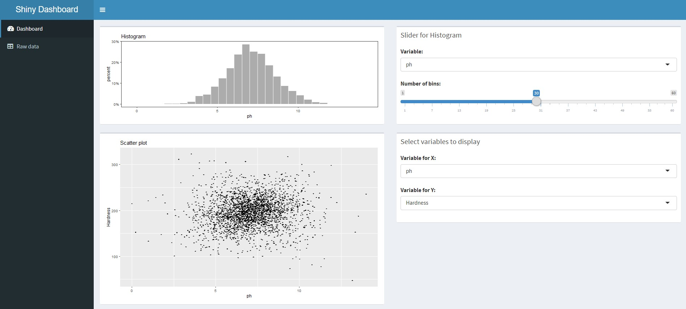
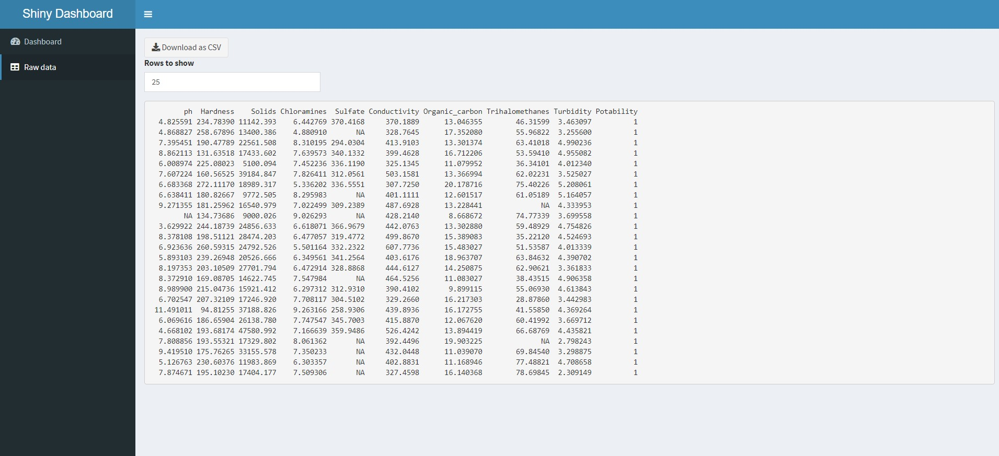

<p align="center">
  
  <h3 align="center">Shiny Dashboard</h3>
  <p align="center"> R Shiny Dashboard inside a Docker container</p>

<details open="open">
  <summary>Table of Contents</summary>
  <ol>
    <li><a href="#about">About</a></li>
    <li><a href="#prerequisites">Prerequisites</a></li>
    <li><a href="#quick-start">Quick Start</a></li>
    <li><a href="#details">Details</a></li>
    <li><a href="#additional-resources">Additional Resources</a></li>
  </ol>
</details>
 
## About

This project contains a sample [Shiny](https://rstudio.github.io/shinydashboard/) dashboard and a Dockerfile which builds and runs the application. Users can use their own datasets to create visualizations in R and make them accessible through a container.
  
## Prerequisites

Below are the tools you need to create this project:

- [R version 4.0.5 (Shake and Throw)](https://mirror.las.iastate.edu/CRAN/)
- [RStudio IDE](https://www.rstudio.com/products/rstudio/download/)
- [Docker Desktop](https://docs.docker.com/get-docker/)
- [GitHub Desktop](https://desktop.github.com/)
- [Have an account on GitHub](https://github.com/join)
- [Have an account on Docker Hub](https://hub.docker.com/signup/)

## Quick Start

To Run this Project:

1. [Docker Desktop](https://docs.docker.com/get-docker/) is the only app you need to have in order to run the finished product so make sure you have Docker installed
2. Once you have the Docker Desktop app and it's running, go to powershell and type the following:
    ```sh
    docker pull dguest390/shiny-dashboard
    ```
3. Once you have pulled the Docker Image to your computer, type the following:
    ```sh
    docker run --rm -p 3838:3838 dguest390/shiny-dashboard
    ```
4. Now you should be hosting your own copy of the Shinydashboard locally, go to your browser and go to the following URL: 
    ```
    127.0.0.1:3838
    ```
## Details

__About The Project Here:__
- Dockerfile
  - The Dockerfile builds a container to allow users to run the app without needing to worry about having to download the source code, data, RStudio, R, or any packages. Notes about the different parts can be found in our Dockerfile. Our Dockerfile can be copied to add to your own project. If your source code has different packages then ours, make sure to add those to your Dockerfile.
- Host your own repository
  - To build a project that others can use you will need to create a Docker Hub repository. Go to [Docker Hub](https://hub.docker.com/signup/) where you can create an account and create a new repository to name whatever you like. Once this repository is created you can build your project. Go to the terminal and change directories into the directory where your project is located and type the command:
  ```sh
  docker build -t [your-directory-name] .
  ```
  - Once you have built your new Docker image you will want to push it to the Docker Hub repository you created. To do this type the command:
  ```sh
  docker push [your-directory-name] [your-docker-hub-account-name]/[your-docker-hub-repository-name]
  ```
  - If successful, others can now pull your image from your Docker Hub to run on their own computer with the commands from our <a href="#quick-start">Quick Start</a> section above. (make sure to replace our [dguest390/shiny-dashboard] with your [docker-hub-account-name/docker-hub-repository-name])
  

__Insert 2 Screenshots Here:__
<p align="center">




## Additional Resources

* [Markdown Cheatsheet](https://www.markdownguide.org/cheat-sheet)
* [Readme Template](https://github.com/othneildrew/Best-README-Template)
* [Shiny Package](https://shiny.rstudio.com/)
